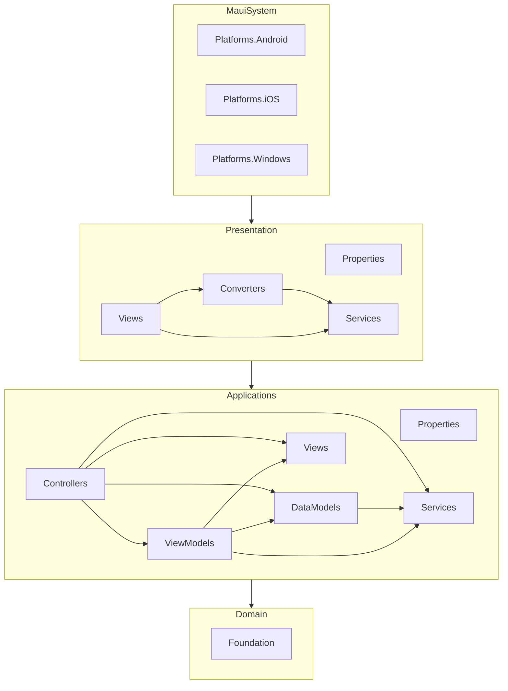

# Architecture

## Namespace (Layer) diagram

```mermaid
flowchart TB

  subgraph MS["MauiSystem"]
    direction LR
    MS_P_A["Platforms.Android"]
    MS_P_I["Platforms.iOS"]
    MS_P_W["Platforms.Windows"]
  end

  subgraph P["Presentation"]
    direction LR
    P_P["Properties"]
    P_C["Converters"]
    P_S["Services"]
    P_V["Views"]
  end

  subgraph A["Applications"]
    direction LR
    A_P["Properties"]    
    A_C["Controllers"]
    A_DM["DataModels"]
    A_S["Services"]
    A_VM["ViewModels"]
    A_V["Views"]
  end

  subgraph D["Domain"]
    direction LR
    D_F["Foundation"]
  end

  MS --> P
  P --> A
  A --> D

  P_C --> P_S
  P_V --> P_C
  P_V --> P_S

  A_C --> A_DM
  A_C --> A_S
  A_C --> A_VM
  A_C --> A_V
  A_DM --> A_S
  A_VM --> A_DM
  A_VM --> A_S
  A_VM --> A_V
```

## Dependency Rules

[config.nsdepcop](./config.nsdepcop)
